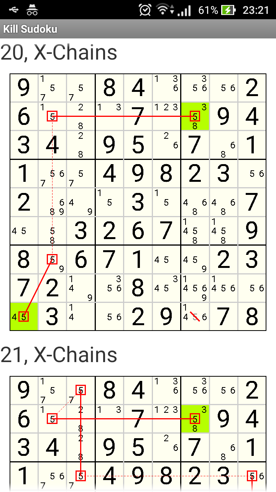
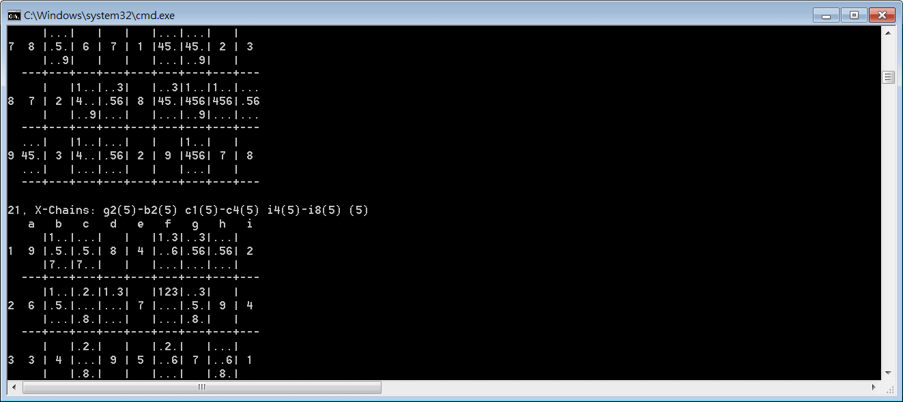

# KillSudoku step by step

Html5 samples https://smallworld.idv.tw/game/ks/aws.html

* learn how to solve soduku step by step
* technique: Naked Single, Hidden Single, Pointing, Claiming, Naked Subset, Hidden Subset, X-Chains, XY-Chains, XYZ-Chains

