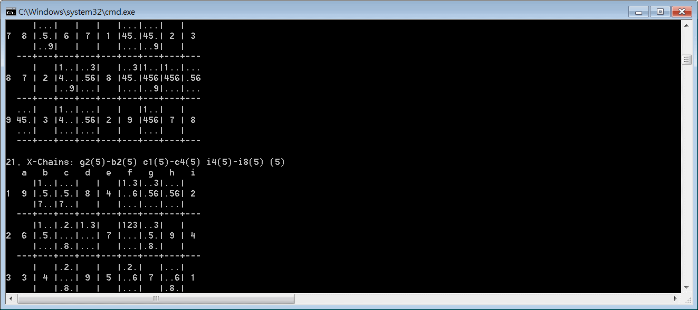

# KillSudoku step by step

Android download https://play.google.com/store/apps/details?id=weilican.ks  
Html5 samples https://agile-hollows-18660.herokuapp.com/game/ks/aws.html

* learn how to solve soduku step by step
* technique: Naked Single, Hidden Single, Pointing, Claiming, Naked Subset, Hidden Subset, X-Chains, XY-Chains, XYZ-Chains

